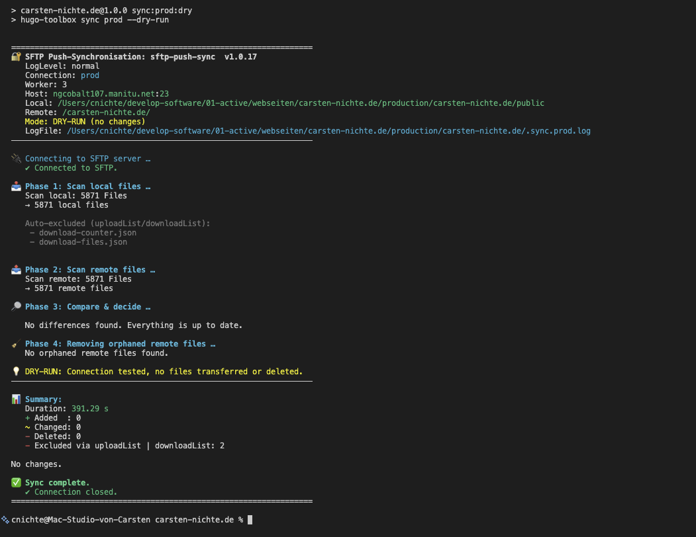

# SFTP Synchronisation Tool

Implements a push syncronisation with Dry-Run. Performs the following tasks:

1. Upload new files
2. Delete remote files that no longer exist locally
3. Identify changes based on size or altered content and upload them

I use the script to transfer [Hugo websites](https://gohugo.io) to the server.

Features:

- multiple connections in `sync.config.json`
- `dry-run` mode
- mirrors local → remote
- adds, updates, deletes files
- text diff detection
- Binary files (images, video, audio, PDF, etc.): SHA-256 hash comparison
- Hashes are cached in .sync-cache.json to save space.
- Parallel uploads/deletions via worker pool
- include/exclude patterns
- Sidecar uploads / downloads - Bypassing the sync process

The file `sftp-push-sync.mjs` is pure JavaScript (ESM), not TypeScript. Node.js can execute it directly as long as "type": "module" is specified in package.json or the file has the extension .mjs.

## Breaking changes in 2.0.0

- The flags `--upload-list` / `--download-list` have been replaced by
  `--sidecar-upload` / `--sidecar-download`.
- The settings for sidecars are now located in the `sidecar` block of the connection.

## Install

```bash
npm i -D sftp-push-sync
# or
npm install --save-dev sftp-push-sync
# or
yarn add --dev sftp-push-sync
# or
pnpm add -D sftp-push-sync
```

## Setup

Create a `sync.config.json` in the root folder of your project:

```json
{
  "connections": {
    "prod": {
      "host": "your.host.net",
      "port": 23,
      "user": "ftpuser",
      "password": "mypassword",
      "syncCache": ".sync-cache.prod.json",
      "worker": 3,
      "sync": {
        "localRoot": "public",
        "remoteRoot": "/folder/"
      },
      "sidecar": {
        "localRoot": "sidecar-local",
        "remoteRoot": "/sidecar-remote/",
        "uploadList": [],
        "downloadList": []
      }
    },
    "staging": {
      "host": "ftpserver02",
      "port": 22,
      "user": "ftp_user",
      "password": "total_secret",
      "syncCache": ".sync-cache.staging.json",
      "worker": 1,
      "sync": {
        "localRoot": "public",
        "remoteRoot": "/web/my-page/"
      },
      "sidecar": {
        "localRoot": "sidecar-local",
        "remoteRoot": "/sidecar-remote/",
        "uploadList": [],
        "downloadList": []
      }
    }
  },
  "include": [],
  "exclude": ["**/.DS_Store", "**/.git/**", "**/node_modules/**"],
  "textExtensions": [".html",".xml",".txt",".json",".js",".css",".md",".svg"],
  "mediaExtensions": [".jpg",".jpeg",".png",".webp",".gif",".avif",".tif",".tiff",".mp4",".mov",".m4v","mp3",".wav",".flac"],
  "progress": {
    "scanChunk": 10,
    "analyzeChunk": 1
  },
  "logLevel": "normal",
  "logFile": ".sftp-push-sync.{target}.log"
}
```

### CLI Usage

```bash
# Normal synchronisation
node bin/sftp-push-sync.mjs staging

# Normal synchronisation + sidecar upload list
node bin/sftp-push-sync.mjs staging --sidecar-upload

# Normal synchronisation + sidecar download list
node bin/sftp-push-sync.mjs staging --sidecar-download

# Only sidecar lists, no standard synchronisation
node bin/sftp-push-sync.mjs staging --skip-sync --sidecar-upload
node bin/sftp-push-sync.mjs staging --skip-sync --sidecar-download

# (optional) only run lists dry
node bin/sftp-push-sync.mjs staging --skip-sync --sidecar-upload --dry-run
```

- Can be conveniently started via the scripts in `package.json`:

```bash
# For example
npm run sync:staging
# or short
npm run ss
```

If you have stored the scripts in `package.json` as follows:

```json

"scripts": {
    "sync:staging": "sftp-push-sync staging",
    "sync:staging:dry": "sftp-push-sync staging --dry-run",
    "ss": "npm run sync:staging",
    "ssd": "npm run sync:staging:dry",

    "sync:prod": "sftp-push-sync prod",
    "sync:prod:dry": "sftp-push-sync prod --dry-run",
    "sp": "npm run sync:prod",
    "spd": "npm run sync:prod:dry",
  },
```

The dry run is a great way to compare files and fill the cache.

### Sidecar uploads / downloads

A list of files that are excluded from the sync comparison and can be downloaded or uploaded separately.

- `sidecar.uploadList`
  - Relative to sidecar.localRoot, e.g. "downloads.json" or "data/downloads.json"
- `sidecar.downloadList`
  - Relative to sidecar.remoteRoot, e.g. "download-counter.json" or "logs/download-counter.json"

```bash
# normal synchronisation
sftp-push-sync staging

# Normal synchronisation + explicitly transfer sidecar upload list
sftp-push-sync staging --sidecar-upload

# just fetch the sidecar download list from the server (combined with normal synchronisation)
sftp-push-sync prod --sidecar-download --dry-run   # view first
sftp-push-sync prod --sidecar-download             # then do
```

- The sidecar is always executed together with sync when using `--sidecar-download` or `--sidecar-upload`.
- With `--skip-sync`, you can exclude the sync process and only process the sidecar:

```bash
sftp-push-sync prod --sidecar-download --skip-sync
```

### Logging Progress

Logging can also be configured.

- `logLevel` - normal, verbose, laconic.
- `logFile` - an optional logFile.
- `scanChunk` - After how many elements should a log output be generated during scanning?
- `analyzeChunk` - After how many elements should a log output be generated during analysis?

For >100k files, use analyzeChunk = 10 or 50, otherwise the TTY output itself is a relevant factor.

### Wildcards

Examples for Wirdcards for `include`, `exclude`, `uploadList` and `downloadList`:

- `"content/**"` -EVERYTHING below `content/`
- `".html", ".htm", ".md", ".txt", ".json"`- Only certain file extensions
- `"**/*.html"` - all HTML files
- `"**/*.md"`- all Markdown files
- `"content/**/*.md"` - only Markdown in `content/`
- `"static/images/**/*.jpg"`
- `"**/thumb-*.*"` - thumb images everywhere
- `"**/*-draft.*"` -Files with -draft before the extension
- `"content/**/*.md"` - all Markdown files
- `"config/**"` - complete configuration
- `"static/images/covers/**"`- cover images only
- `"logs/**/*.log"` - all logs from logs/
- `"reports/**/*.xlsx"`

practical excludes:

```txt
"exclude": [
  ".git/**",           // kompletter .git Ordner
  ".idea/**",          // JetBrains
  "node_modules/**",   // Node dependencies
  "dist/**",           // Build Output
  "**/*.map",          // Source Maps
  "**/~*",             // Emacs/Editor-Backups (~Dateien)
  "**/#*#",            // weitere Editor-Backups
  "**/.DS_Store"       // macOS Trash
]
```

## Which files are needed?

- `sync.config.json` - The configuration file (with passwords in plain text, so please leave it out of the git repository)

## Which files are created?

- The cache files: `.sync-cache.*.json`
- The log file: `.sftp-push-sync.{target}.log` (Optional, overwritten with each run)

You can safely delete the local cache at any time. The first analysis will then take longer again, because remote hashes will be streamed again. After that, everything will run fast.

Note: The first run always takes a while, especially with lots of images – so be patient! Once the cache is full, it will be faster.

## Example Output



## Links

- <https://www.npmjs.com/package/sftp-push-sync>
- <https://github.com/cnichte/sftp-push-sync>
